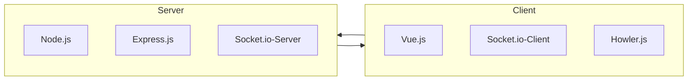
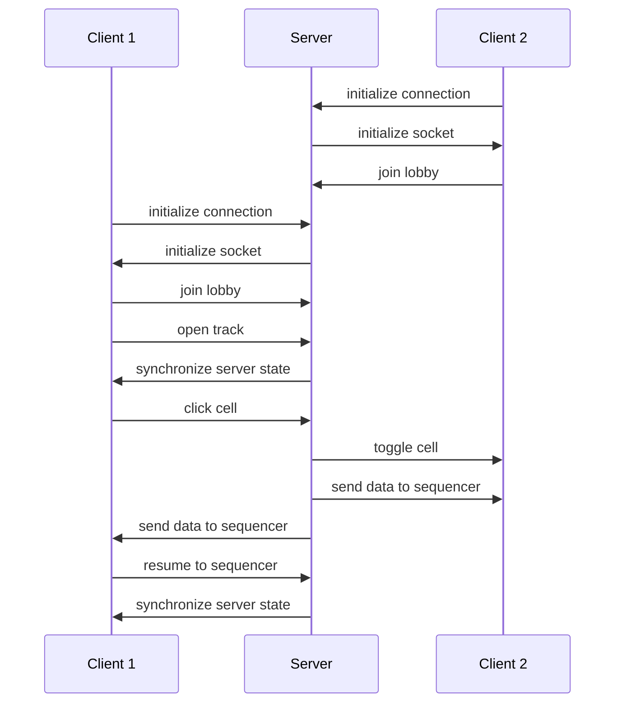

# README MashRoom
MashRoom was developed for studio_UxWebmobile2_2023 at Digital Ideation HSLU. The project is using vue.js, node.js, express, socket.io and howler.js. The Goal was creating a music sequencer with collaboration features for creating music together

## How to play?
Requirements: Node.js

1. Download repo

2. Start node server in console: "node src/server.js"

4. Start vue in console: "npm run dev"

5. Open http://127.0.0.1:5173/

6. Play!

## Architecture diagram

## Sequence diagram

